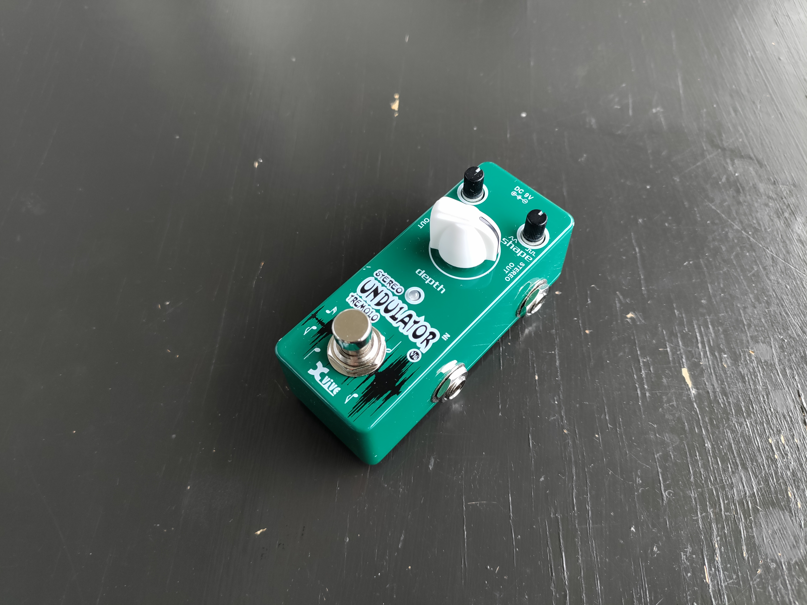

# Guitar-pedal-repair

## Boss ODB-3

#### Problem:

Doesn't turn on

#### Fix:

Replaced switch

## Ibanez TS5

#### Problem:

Switch unreliable, potentiometer knobs missing

#### Fix:

Adding bigger button debounce capacitor and 3D printing potentiometer knobs

## Danelectro Dan-Echo

#### Problem:

Broken potentiometer

#### Fix:

Replaced potentiometer

## Xvive Undulator

#### Problem:

No signal

#### Fix:

Inspecting pcb and resoldering bad connections

## Electro-Harmonix Crayon

#### Problem:

Bad switch

#### Fix:

Replaced switch

## Electro-Harmonix Metal Muff

#### Problem:

No signal. Most likely op amp failure

#### Fix:

in progress